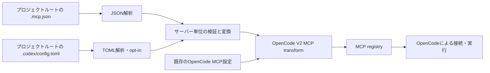

## 位置づけ

この文書は構成と実装範囲を記録する。現在は stdio と Streamable HTTP のサーバー定義の取り込みと OpenCode 経由の動作確認まで完了している。Codex 設定の静的 HTTP ヘッダーは受信側でも確認済み。機能要件は [prd.md](./prd.md)、開発・配布の方針は [tech-stack.md](./tech-stack.md) を参照する。

このプラグインは、プロジェクトルート直下の **単一の `.mcp.json`** と、明示 opt-in 時のみ `.codex/config.toml` を OpenCode V2 の MCP 設定に取り込む。`*.mcp.json` の検索、親ディレクトリの走査、グローバルな設定ファイルの読み込みは行わない。入力ファイルを正本とし、OpenCode の設定ファイルや生成ファイルには書き込まない。

## データフロー

プラグインはサーバー定義を渡すまでを担当し、サーバープロセスの起動や通信、認証、ツール公開は OpenCode に任せる。`.mcp.json` は MCP プロトコル自体の仕様ではなく、クライアント側の設定形式として扱う。

## 責務分担

| 境界 | 責務 |
| --- | --- |
| `src/index.ts` | Plugin ID `opencode-mcp-json-adapter` を公開し、読み込み結果を MCP transform に登録する。 |
| `src/mcp_json.ts` | JSON解析、`mcpServers` 以下のサーバー単位の検証、stdio / HTTP 定義の変換を行う。OpenCode を起動せず単体テストできる。 |
| `src/codex_toml.ts` | TOML解析、`mcp_servers` 以下のサーバー単位の検証、stdio / HTTP 定義の変換を行う。 |
| OpenCode | MCP registry の構築、接続のライフサイクル、実際のサーバー起動・通信を担う。 |

ファイルの読み込みと入力元の優先順位は `src/index.ts`、内容の解析・変換は入力元ごとのパーサーが担当する。独立した内部表現は設けない。

## 入力の選択とライフサイクル

プラグインの `setup(ctx)` で `ctx.location.project.directory` をプロジェクトルートとして、その直下の `.mcp.json` と、明示 opt-in 時のみ `.codex/config.toml` を読む。セッションごとに別の設定ファイルを探したり、プラグインのインストール先を基準にしたりしない。worktree でこの値が期待する checkout を指すかは未確認である。

選択されたファイルがなければ何も登録しない。存在する場合は読み込みと検証を transform 登録前に済ませ、同期的な transform の中では用意済みの定義だけを反映する。現行実装は起動時の読み込みに限定し、ファイル監視は行わない。将来更新に対応する場合は、再読込後に `ctx.mcp.reload()` で既存の transform を再適用する方式とし、必要性を確認してから追加する。

## 変換と優先順位

入力は `.mcp.json` の `mcpServers` にある名前付き定義とする。stdio の `command` / `args` / `env` / `cwd` を OpenCode V2 の `type: "local"`、コマンド配列、`environment` などに変換する。`type: "http"` とエイリアス `"streamable-http"` の remote は絶対 HTTP(S) URL と文字列の headers を受け取り、OpenCode の `type: "remote"` に変換する。サーバー別 `timeout` は 1000 ミリ秒以上の整数なら OpenCode の `timeout.execution` に渡す。OpenCode では prompt・resource にも適用されるため、元のツール呼び出しタイムアウトと完全に同じ意味ではない。旧式 HTTP+SSE と標準外の WebSocket は扱わない。未対応のハーネス固有フィールドから OAuth などを推測しない。

`ctx.mcp.transform` のコールバックでは、各サーバーについて `editor.get(name)` で既存定義を確認する。既に同名の定義があれば `editor.set` せず、OpenCode ネイティブ設定を優先する。存在しない定義のみ追加する。プラグインが別のサーバーを削除・更新することはない。transform は再適用され得るため、外部の状態を書き換えず、同じ入力に対して同じ登録結果を返す。

## エラーと安全性

- ファイルがない場合は正常な状態として扱う。JSON 全体が不正ならファイルパスと理由を診断し、取り込みを行わない。
- 一部のサーバーだけが不正なら、その定義を飛ばし、残りの正常なサーバーを登録する。未知のフィールドは、必要な項目の検証を妨げない限り無視する。
- 診断には対象ファイル・サーバー名・フィールド名などを使い、環境変数値、headers、入力 JSON 全体を出力しない。
- プラグイン自身は MCP の `command` を実行しない。ファイル探索をプロジェクトルート外に広げず、入力ファイルも変更しない。

## 検証の境界

読み込み・変換の単体テストでは、ファイル不在、空の一覧、stdio / remote、複数サーバー、不正な JSON、一部のみ不正、未知のフィールド、名前衝突、Windows / Unix のコマンドとパスを扱う。MCP サーバーの起動を必要としないテストにする。

ルートの `.mcp.json` に設定済みの `everything-stdio` と `everything-remote` を利用した。stdio は OpenCode でツールが見え、`echo` を呼び出せることを確認済み。remote は Everything サーバーを `deno x -A -y npm:@modelcontextprotocol/server-everything streamableHttp` で別プロセスとして起動し、OpenCode の別インスタンスで両方のサーバーが connected となり、remote 側の `echo` を呼び出せることを確認した。検証用プロセスは終了済み。

## Codex 設定の取り込み

既存の `.mcp.json` の読み込みと OpenCode V2 MCP transform は維持し、追加の入力元としてプロジェクトルート直下の `.codex/config.toml` を明示 opt-in で読む。トップレベルの `[mcp_servers]` だけを対象とし、Codex の総合設定や親・ユーザー共通設定は取り込まない。Codex の信頼判定を模倣せず、`sources` をグローバルに指定すれば複数プロジェクトへ適用される。

`options.sources` の既定値は `["mcp-json"]`。指定された入力元を順に解析・検証し、同名サーバーがあれば最初の有効な定義を保持する。最後に MCP transform で OpenCode ネイティブの同名定義があれば追加しない。衝突時は通常警告せず、読めないファイルや不正な定義の診断には秘密値を含めない。両方の入力元がなくても正常な状態とする。

Codex の TOML 解析には `smol-toml` を使用する。`src/codex_toml.ts` はサーバー単位で検証し、stdio の `command` / `args` / `env` / `cwd` を local 定義へ、remote の `url` / `http_headers` を remote 定義へ変換する。両方の入力元を `src/index.ts` で順に読み込み、同じ MCP transform で登録する。独立した内部表現は設けない。未対応の認証設定を持つサーバーは取り込まない。

`env_http_headers` と `bearer_token_env_var` は明示オプション `allowCodexEnvHttpHeaders: true` でのみ取り込む。無効時は該当サーバーを定義ごとスキップし、先勝ちの優先順位では次の有効な定義が採用可能となる。有効時はプラグインが OpenCode プロセスの環境変数を起動時に読む。`env_http_headers` は空白だけの値を追加せず、値があれば大文字・小文字を区別せず静的ヘッダーに優先させる。Bearer は値から `Authorization: Bearer <値>` を生成し、同名の静的・環境変数由来のヘッダーより優先する。Bearer の値が未設定・空白・不正ならサーバーを登録しない。プラグインの MCP transform に渡した `{env:NAME}` は OpenCode V2.0.18 では展開されないため、値を直接登録する。この値が `/api/config` や `/api/mcp` に現れないことはダミー値で検証するが、秘密値隔離の保証とはみなさない。
