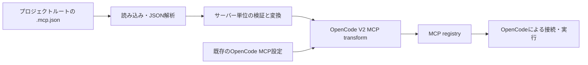

## 位置づけ

この文書は構成と実装範囲を記録する。現在は stdio と Streamable HTTP のサーバー定義の取り込みと OpenCode 経由の動作確認まで完了している。機能要件は [prd.md](./prd.md)、開発・配布の方針は [tech-stack.md](./tech-stack.md) を参照する。

このプラグインは、プロジェクトルート直下の **単一の `.mcp.json`** を OpenCode V2 の MCP 設定に取り込む。`*.mcp.json` の検索、親ディレクトリの走査、グローバルな `.mcp.json` の読み込みは行わない。入力ファイルを正本とし、OpenCode の設定ファイルや生成ファイルには書き込まない。

## データフロー

プラグインはサーバー定義を渡すまでを担当し、サーバープロセスの起動や通信、認証、ツール公開は OpenCode に任せる。`.mcp.json` は MCP プロトコル自体の仕様ではなく、クライアント側の設定形式として扱う。

## 責務分担

| 境界 | 責務 |
| --- | --- |
| `src/index.ts` | Plugin ID `opencode-mcp-json-adapter` を公開し、読み込み結果を MCP transform に登録する。 |
| `src/mcp_json.ts` | JSON解析、`mcpServers` 以下のサーバー単位の検証、stdio / HTTP 定義の変換を行う。OpenCode を起動せず単体テストできる。 |
| OpenCode | MCP registry の構築、接続のライフサイクル、実際のサーバー起動・通信を担う。 |

ファイルの読み込みは `src/index.ts`、内容の解析・変換は `src/mcp_json.ts` が担当する。独立した内部表現や追加のファイル分割は設けない。

## 入力の選択とライフサイクル

プラグインの `setup(ctx)` で `ctx.location.project.directory` をプロジェクトルートとして、その直下の `.mcp.json` を読む。セッションごとに別の `.mcp.json` を探したり、プラグインのインストール先を基準にしたりしない。worktree でこの値が期待する checkout を指すかは未確認である。

ファイルがなければ何も登録しない。存在する場合は読み込みと検証を transform 登録前に済ませ、同期的な transform の中では用意済みの定義だけを反映する。初期実装は起動時の読み込みに限定し、ファイル監視は行わない。将来更新に対応する場合は、再読込後に `ctx.mcp.reload()` で既存の transform を再適用する方式とし、必要性を確認してから追加する。

## 変換と優先順位

入力は `.mcp.json` の `mcpServers` にある名前付き定義とする。stdio の `command` / `args` / `env` / `cwd` を OpenCode V2 の `type: "local"`、コマンド配列、`environment` などに変換する。`type: "http"` の remote は絶対 HTTP(S) URL と文字列の headers を受け取り、OpenCode の `type: "remote"` に変換する。SSE などの別 transport は扱わない。未対応のハーネス固有フィールドから OAuth などを推測しない。

`ctx.mcp.transform` のコールバックでは、各サーバーについて `editor.get(name)` で既存定義を確認する。既に同名の定義があれば `editor.set` せず、OpenCode ネイティブ設定を優先する。存在しない定義のみ追加する。プラグインが別のサーバーを削除・更新することはない。transform は再適用され得るため、外部の状態を書き換えず、同じ入力に対して同じ登録結果を返す。

## エラーと安全性

- ファイルがない場合は正常な状態として扱う。JSON 全体が不正ならファイルパスと理由を診断し、取り込みを行わない。
- 一部のサーバーだけが不正なら、その定義を飛ばし、残りの正常なサーバーを登録する。未知のフィールドは、必要な項目の検証を妨げない限り無視する。
- 診断には対象ファイル・サーバー名・フィールド名などを使い、環境変数値、headers、入力 JSON 全体を出力しない。
- プラグイン自身は MCP の `command` を実行しない。ファイル探索をプロジェクトルート外に広げず、入力ファイルも変更しない。

## 検証の境界

読み込み・変換の単体テストでは、ファイル不在、空の一覧、stdio / remote、複数サーバー、不正な JSON、一部のみ不正、未知のフィールド、名前衝突、Windows / Unix のコマンドとパスを扱う。MCP サーバーの起動を必要としないテストにする。

ルートの `.mcp.json` に設定済みの `everything-stdio` と `everything-remote` を利用した。stdio は OpenCode でツールが見え、`echo` を呼び出せることを確認済み。remote は Everything サーバーを `deno x -A -y npm:@modelcontextprotocol/server-everything streamableHttp` で別プロセスとして起動し、OpenCode の別インスタンスで両方のサーバーが connected となり、remote 側の `echo` を呼び出せることを確認した。検証用プロセスは終了済み。
