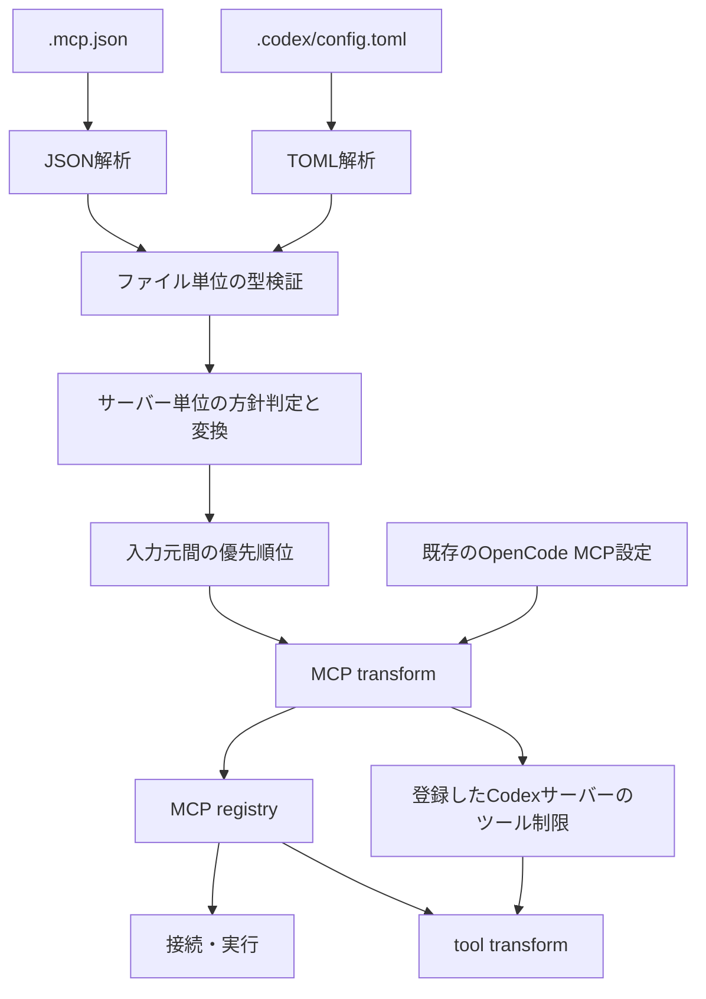

## データフロー

プラグインは設定ファイルの読み込みからサーバー定義の登録までを担当する。MCP サーバーの起動・通信と、登録後のツールカタログの構築は OpenCode に委ねる。ツール制限のある Codex サーバーについては、OpenCode のツール登録後にプラグインが除外を適用する。

## コンポーネントと依存

| 境界 | 責務 |
| --- | --- |
| `src/index.ts` | プロジェクトルートからの入力元の選択・読み込み、入力元間の優先順位、MCP transform への登録と tool transform の適用。 |
| `src/mcp_json/schema.ts` / `src/codex/schema.ts` | 各入力形式の既知フィールドの形と型を Valibot で定義する。 |
| `src/mcp_json/index.ts` / `src/codex/index.ts` | それぞれの形式を解析し、ファイル単位の型検証後、サーバー単位の方針判定・OpenCode 定義への変換・診断の集約を行う。 |
| `src/parse_result.ts` | 両パーサーが `src/index.ts` に返すサーバー定義と診断の型。 |
| OpenCode | MCP registry、サーバーの接続と実行、ツールカタログの管理。 |

入力形式ごとのスキーマとパーサーは互いに依存しない。独立した中間表現は設けず、共有するのは登録に必要な結果型だけとする。ファイル全体の型検証に失敗した場合、パーサーはそのファイルのサーバー定義を返さない。opt-in 不足や値の解決失敗など、検証後の方針上のスキップは各入力元のパーサー内でサーバー単位に処理する。どの項目を検証・変換・スキップするかの正本は [入力仕様](./prd.md) とする。

## 読み込みと登録のライフサイクル

`setup(ctx)` は `ctx.location.project.directory` を基準に、選択された入力元のファイルだけを起動時に読む。インストール先や親ディレクトリは探索しない。ファイルが存在しない場合、その入力元からは何も追加しない。

解析と変換を transform の登録前に済ませ、`ctx.mcp.transform` には用意済みの定義を渡す。入力元同士で同名の有効な定義がある場合は先に選択されたものを保持する。transform では `editor.get(name)` で OpenCode ネイティブの定義を確認し、同名なら追加しない。既存の定義を削除・更新しない。現在はファイル監視や自動再読み込みを行わない。

Codex のツール制限は、実際に MCP transform で登録できたサーバーだけを対象に `ctx.tool.transform` で適用する。ツール名に使われるサーバー名の正規化で別サーバーと衝突する場合は、誤って他のツールを除外しないよう対象 Codex サーバーを登録しない。優先順位とツール制限の利用者向けの意味は [入力仕様](./prd.md) に記載する。

## 変換時の外部依存と診断

`.mcp.json` のパーサーでは、変数展開に使う環境変数リゾルバを一度選び、stdio と remote の変換へ渡す。stdio は同じサーバーの `env` を先に参照し、足りない値をそのリゾルバから取得する。remote はリゾルバを直接使う。Codex のパーサーでは、環境変数を使う remote ヘッダーの変換にだけリゾルバを渡し、使わない local の変換には渡さない。具体的な展開対象や opt-in 条件は [入力仕様](./prd.md) に委ねる。

構文エラーと型違反の診断は入力元のパーサーが生成し、`src/index.ts` が対象ファイルを付けて出力する。変換後の値や秘密値を診断に含めない。プラグインは入力ファイルも OpenCode 設定ファイルも書き換えない。
