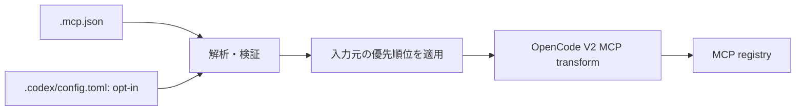

# opencode-mcp-json-adapter

## 目的

OpenCode V2 で、プロジェクトローカルの `.mcp.json` をそのまま利用できるようにする軽量なOpenCode Plugin。

OpenCode固有の `opencode.jsonc` にMCP設定を重複記述する必要をなくし、複数のagent harness間でプロジェクトのMCP設定を共有しやすくする。

## 基本方針

- OpenCode V2のみを対象とする。
- V1互換は提供しない。
- OpenCodeが既にネイティブ対応している機能は再実装しない。
- Claude Code等、特定ハーネス全体との互換性は目的にしない。
- 責務はプロジェクトローカルの MCP 設定の取り込みに限定する。
- 元の `.mcp.json` を正本とし、変換済みファイルは生成しない。
- OpenCodeの設定ファイルを書き換えない。
- 起動時のインメモリ変換だけで完結させる。

## 対象外

以下はOpenCode自身に任せ、このPluginでは扱わない。

- `AGENTS.md`
- `.agents/skills/`
- OpenCode agents
- commands
- hooks
- prompts
- permissions
- provider/model設定
- Claude Code固有設定
- GitHub Copilot固有設定
- Agent Plugin形式
- marketplace / plugin installation infrastructure

将来OpenCode本体が `.mcp.json` をネイティブ対応した場合、このPluginは役目を終えられる程度の薄さを維持する。

## 入力

OpenCode V2 のプラグイン `options.sources` で入力元を選ぶ。省略時は `["mcp-json"]` とし、`"codex"` は明示的に指定した場合だけ読む。例えば `sources: ["mcp-json", "codex"]` は両方を有効にする。配列には `"mcp-json"` と `"codex"` だけを指定でき、重複は除去する。不正な指定では読み込みを行わず診断する。各入力元は OpenCode の現在のプロジェクトルート直下のファイルだけを読む。親ディレクトリやユーザー共通の設定を探索せず、ユーザーグローバルな独自の配置規約も設けない。グローバルプラグインで Codex を opt-in した場合は、その設定が適用される各プロジェクトが読み込み対象になる。プラグイン名と ID の変更は別タスクで検討する。

設定例（パッケージ名は現行のまま記載）:

```jsonc
{
  "plugins": [
    {
      "package": "opencode-mcp-json-adapter",
      "options": { "sources": ["mcp-json", "codex"] }
    }
  ]
}
```

以下の「変換」「スキップ」「無視」は現行実装の挙動を表す。「要検討」は将来の対応を約束するものではない。不正なファイルやサーバーの扱いと、同名定義の優先順位は後述する。

### `.mcp.json`（既定の入力元）

プロジェクトルートの `.mcp.json` にある `mcpServers` オブジェクトを読む。これは MCP プロトコルが定める共通の設定ファイルではなく、本プラグインが採用するクライアント側の設定形式の一部である。例:

```json
{
  "mcpServers": {
    "local-tools": {
      "command": "deno",
      "args": ["run", "server.ts"],
      "env": { "MODE": "test" },
      "cwd": "./tools"
    },
    "remote-tools": {
      "type": "http",
      "url": "https://example.com/mcp",
      "headers": { "X-Example": "test" }
    }
  }
}
```

| フィールド | 入力形式・対応方針 |
| --- | --- |
| `mcpServers` | 必須のオブジェクト。キーをサーバー名、値を定義オブジェクトとして扱う。欠落・型違いはファイル全体を解析せず診断する。空オブジェクトは可。 |
| `mcpServers.<name>.type` | 省略または `"stdio"` は stdio、`"http"` は Streamable HTTP。その他（`"sse"` を含む）はサーバーごとスキップする。 |
| `command` | stdio で必須の空白以外を含む文字列。OpenCode の local `command` 配列の先頭へ変換する。 |
| `args` | stdio で任意の文字列配列。`command` の後ろへ追加する。 |
| `env` | stdio で任意の文字列値のマップ。OpenCode の local `environment` へ変換する。 |
| `cwd` | stdio で任意の空白以外を含む文字列。OpenCode の local `cwd` へ渡す。 |
| `url` | `type: "http"` で必須の絶対 HTTP(S) URL。OpenCode の remote `url` へ渡す。`type` が省略または `"stdio"` の場合は、`url` があればサーバーをスキップする。 |
| `headers` | `type: "http"` で任意の文字列値のマップ。OpenCode の remote `headers` へ渡す。 |
| 上記以外のフィールド | 現状は検証せず無視する。OAuth や権限制約など、別のクライアント固有の項目をここから推測・変換しない。制約の黙殺は安全上の要検討事項。 |

`type: "http"` に stdio 用の `command` / `args` / `env` / `cwd` を併記しても現状は無視され、stdio に `headers` を付けても無視される。旧式の HTTP+SSE transport は、MCP 2026-07-28 仕様で非推奨となったため意図的に対象外とする。Streamable HTTP のレスポンスで使われる SSE を除外するという意味ではない。[^mcp-2026-07-28]

### `.codex/config.toml`（明示 opt-in の入力元）

プロジェクトルートの `.codex/config.toml` のトップレベルの `[mcp_servers]` だけを読む。Codex の trust 判定、設定の他レイヤー、profiles・model・sandbox・approval などの MCP 以外の項目は取り込まない。例:

```toml
[mcp_servers.local-tools]
command = "deno"
args = ["run", "server.ts"]
env = { MODE = "test" }
cwd = "./tools"

[mcp_servers.remote-tools]
url = "https://example.com/mcp"
http_headers = { "X-Example" = "test" }
env_http_headers = { "X-Region" = "MCP_REGION" }
bearer_token_env_var = "MCP_TOKEN"
```

後者の `env_http_headers` と `bearer_token_env_var` を含むサーバーを取り込むには、前述の `sources` に加えてプラグイン設定で `"allowCodexEnvHttpHeaders": true` が必要。真偽値の `true` 以外では有効にならない。以下は [Codex の MCP 設定項目][codex-mcp] と現行パーサーの対応関係であり、OpenCode ネイティブの設定項目一覧ではない。

| フィールド | 入力形式・現行の対応方針 |
| --- | --- |
| `mcp_servers.<name>` | トップレベルのテーブル。キーをサーバー名として扱う。`mcp_servers` がなければ何も追加しない。テーブル以外は診断する。 |
| `enabled` | 真偽値。`false` なら取り込まない。省略・`true` なら以下を検証する。型違いはサーバーごとスキップする。 |
| `command` / `args` / `env` / `cwd` | stdio 用。`command` は必須の非空文字列、`args` は文字列配列、`env` は文字列値のマップ、`cwd` は非空文字列。OpenCode の local 定義へ変換する。 |
| `url` / `http_headers` | Streamable HTTP 用。`url` は必須の絶対 HTTP(S) URL、`http_headers` は任意の文字列値のマップ。OpenCode の remote 定義へ変換する。`url` と `command` の併用はスキップする。 |
| `env_http_headers` | ヘッダー名と環境変数名の文字列マップ。既定ではサーバー定義ごとスキップ。`allowCodexEnvHttpHeaders: true` 時のみ環境変数を読み、未設定・空白ならそのヘッダーを省略し、値があれば同名の静的ヘッダーより優先する。stdio には使えない。 |
| `bearer_token_env_var` | Bearer トークンの環境変数名を表す非空文字列。既定ではサーバー定義ごとスキップ。同じ opt-in 時に `Authorization: Bearer <値>` を組み立て、同名の静的・環境変数由来ヘッダーより優先する。未設定・空白・不正な値ならサーバーごとスキップし、認証なしで登録しない。stdio には使えない。OAuth のログイン・更新は実装しない。 |
| `env_vars` | Codex の stdio 向け環境変数転送指定。現状はサーバーごとスキップして診断する。`env` とは別の機能であり、ローカル・リモートの値の取得元も含めて要検討。 |
| `http_headers_helper` | 動的ヘッダー取得コマンド。現状はサーバーごとスキップして診断する。再取得・再試行やコマンド実行を伴うため、静的ヘッダーへの変換はしない。 |
| `auth` / `[mcp_servers.<name>.oauth]` | Codex の認証選択（`oauth` / `chatgpt`）や OAuth クライアント設定（`client_id`、`callback_url`、`callback_port`）。現状はサーバーごとスキップして診断する。OpenCode ネイティブの OAuth と同一視して自動変換しない。OAuth が必要でもこれらの項目がなければ、取り込んだ remote サーバーへの認証は OpenCode に任せる。 |
| `scopes` / `oauth_resource` | Codex が OAuth で要求するスコープの配列と対象リソースの指定。現状は無視する。認証の対象・権限が変わる可能性があるため、黙殺の安全性を要検討。 |
| `bearer_token` | パーサーが認証の黙殺を避けるため拒否する項目。現状はサーバーごとスキップして診断する。Codex の一般的な設定項目としてのサポートを意味しない。 |
| `startup_timeout_sec` / `startup_timeout_ms` / `tool_timeout_sec` | Codex の秒単位の起動・ツール実行タイムアウトと、起動タイムアウトのミリ秒単位の別名。現状は無視する。OpenCode のタイムアウトとの意味・単位の対応を調べてから変換可否を判断する。 |
| `required` | 接続失敗時の起動失敗指定。現状は無視する。OpenCode に同等の動作を保証できるか要検討。 |
| `enabled_tools` / `disabled_tools` | ツールの許可・拒否リスト。現状は**無視してサーバーを登録する**。Codex で制限していたツールが OpenCode では見える可能性があり、優先して安全な扱いを決める必要がある。 |
| `default_tools_approval_mode` / `[mcp_servers.<name>.tools.<tool>]` | ツールごとの `approval_mode` や `output_token_limit` を含む Codex の承認・出力制約。現状は**無視してサーバーを登録する**。権限境界の違いを踏まえ、警告・サーバー単位のスキップ・対応の可否を要検討。 |
| `experimental_environment` | `remote` を指定してリモート実行環境で stdio を起動する Codex 固有の項目。現状は無視し、OpenCode のローカル stdio として登録するため、誤実行を避ける扱いが要検討。 |
| 上記以外のサーバー項目 | 現状は無視する。未知の認証・実行・権限制約まで安全に無視できるという保証ではない。 |

`url` がないサーバーでは有効な `command` が必要であり、どちらもなければスキップする。remote に stdio 用の `args` / `env` / `cwd` を併記しても現状は無視され、stdio に HTTP 用の `http_headers` を付けても無視される。`env_http_headers` と `bearer_token_env_var` だけは stdio に付けるとサーバーをスキップする。

トップレベルの `mcp_optional_startup_grace_ms`、`mcp_oauth_callback_port`、`mcp_oauth_callback_url` など、`mcp_servers` 以外の Codex 設定はすべて無視する。これらは現状のパーサーによる取り込み範囲外であり、Codex 全体の設定互換は目指さない。

Bearer と任意の環境変数由来ヘッダーは同じ opt-in にまとめるが、Codex の秘密値隔離ポリシーは再現しない。プラグインが OpenCode プロセスの環境変数を起動時に読み、登録時に秘密値を渡す。リスクとグローバル設定での適用範囲は README に記載する。

[codex-mcp]: https://developers.openai.com/codex/mcp

[^mcp-2026-07-28]: [MCP 2026-07-28 仕様の発表（Deprecations）](https://redirect.github.com/modelcontextprotocol/modelcontextprotocol/blob/main/blog/content/posts/2026-07-28-spec-ga/index.md)

## 変換

概念的には以下とする。



独立した内部表現は設けず、解析済みの定義を共通の MCP transform に渡す。

## OpenCode統合

OpenCode V2 Plugin APIのMCP extension pointを使用する。

Plugin ID:

```text
opencode-mcp-json-adapter
```

## 設定優先順位

OpenCodeネイティブ設定を優先する。

同じserver nameが `.mcp.json` と `opencode.jsonc` の両方に存在する場合は、`opencode.jsonc` 側を採用する。

`.mcp.json` はfallback/import sourceとして扱う。

Codex を有効化した場合も OpenCode ネイティブ設定を最優先する。import 元同士で同名サーバーがある場合は `sources` の先に書いた入力元の有効な定義を採用し、通常は衝突警告を出さない。設定上の優先順位をエージェント向けの警告に依存させない。

## エラー処理

`.mcp.json` が存在しない場合は何もしない。

JSONが不正な場合は対象ファイルと理由が分かる診断を出す。

未知のフィールドは可能な限り無視する。

対応できないserver定義があっても、他の正常なserverまで無効化しない。

secretになり得る値をログへ出力しない。

## `.mcp.json` dialect

MCP protocolそのものと `.mcp.json` のclient-side設定形式は別物であることをREADMEで明記する。

初期実装では、広く使われているproject-local `.mcp.json` の共通部分のみを対象とする。

特定ハーネス固有拡張を大量に取り込まない。

## 配布

OpenCode V2 Pluginとしてnpm packageで配布する。

利用者はOpenCodeのPlugin機構から追加できる形を想定する。

グローバルPluginとして導入し、各repositoryの `.mcp.json` を自動利用できるUXを推奨する。

## 開発時の利用

開発中は公開packageを使用せず、OpenCodeのプロジェクトローカル設定からローカルrepositoryを直接参照できるようにする。

公開版と開発版で同じPlugin IDを使用する。

必要なら開発環境ではグローバル版を無効化してローカル版を優先する。

## テスト

最低限以下を自動テストする。

- `.mcp.json` がない
- 空のserver一覧
- stdio server
- stdio + args
- stdio + env
- remote server
- remote + headers
- 複数server
- malformed JSON
- 一部serverのみ不正
- 未知field
- OpenCodeネイティブ設定との名前衝突
- Windows向けcommand/path
- Unix向けcommand/path

変換処理はOpenCode本体を起動せずunit testできるよう分離する。

Codex 対応では、既定の入力元、Codex の opt-in、MCP 以外の設定の無視、stdio / remote の変換、入力元同士と OpenCode ネイティブ設定との同名衝突、不正な TOML や一部のみ不正なサーバー定義をテストする。静的な `http_headers` と opt-in の `env_http_headers` / `bearer_token_env_var` は OpenCode 経由の受信確認も行う。環境変数由来のヘッダーは無効時のサーバー単位のスキップ、有効時の未設定・空白・静的ヘッダーとの衝突をテストする。

## セキュリティ

Plugin自身はcommandを実行しない。

`.mcp.json` を読み、OpenCodeへserver definitionとして渡すだけにする。

環境変数やheader値などsecretになり得る値をログへ出さない。

ファイル探索はworkspace外へ不用意に広げない。

## 成功条件

ユーザーがグローバルに `opencode-mcp-json-adapter` を有効化していれば、

```text
repo/
├─ .mcp.json
└─ ...
```

だけで、そのMCP server群をOpenCode V2から利用できる。

かつ、

- repositoryに生成ファイルを追加しない
- `.mcp.json` を変更しない
- OpenCodeネイティブMCP設定を壊さない
- `AGENTS.md` / Skills等には介入しない
