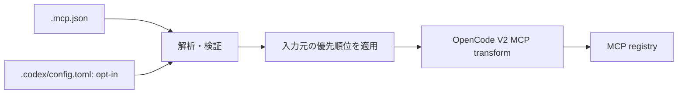

# opencode-mcp-json-adapter

## 目的

OpenCode V2 で、プロジェクトローカルの `.mcp.json` をそのまま利用できるようにする軽量なOpenCode Plugin。

OpenCode固有の `opencode.jsonc` にMCP設定を重複記述する必要をなくし、複数のagent harness間でプロジェクトのMCP設定を共有しやすくする。

## 基本方針

- OpenCode V2のみを対象とする。
- V1互換は提供しない。
- OpenCodeが既にネイティブ対応している機能は再実装しない。
- Claude Code等、特定ハーネス全体との互換性は目的にしない。
- 責務はプロジェクトローカルの MCP 設定の取り込みに限定する。
- 元の `.mcp.json` を正本とし、変換済みファイルは生成しない。
- OpenCodeの設定ファイルを書き換えない。
- 起動時のインメモリ変換だけで完結させる。

## 対象外

以下はOpenCode自身に任せ、このPluginでは扱わない。

- `AGENTS.md`
- `.agents/skills/`
- OpenCode agents
- commands
- hooks
- prompts
- permissions
- provider/model設定
- Claude Code固有設定
- GitHub Copilot固有設定
- Agent Plugin形式
- marketplace / plugin installation infrastructure

将来OpenCode本体が `.mcp.json` をネイティブ対応した場合、このPluginは役目を終えられる程度の薄さを維持する。

## 入力

プロジェクトローカルの `.mcp.json` を読み込む。

初期実装では、現在のOpenCode project/workspaceに属する `.mcp.json` のみを対象とする。

ユーザーグローバルな独自 `.mcp.json` 配置規約は設けない。

### Codex のプロジェクト設定

既存の `.mcp.json` 対応を維持しつつ、プロジェクトルート直下の `.codex/config.toml` にあるトップレベルの `[mcp_servers]` を取り込む。親ディレクトリの探索、ユーザー共通設定の読み込み、Codex の設定レイヤーの再現は行わない。モデル、sandbox、approval、profiles など MCP 以外の設定は対象外とする。Codex におけるプロジェクトの信頼判定は OpenCode の設定読み込みには引き継がず、別のメンタルモデルとして扱う。

OpenCode V2 のプラグイン `options.sources` で入力元を選ぶ。省略時は `["mcp-json"]` とし、Codex 設定は `"codex"` を指定した場合だけ読む。例えば `sources: ["mcp-json", "codex"]` は両方を有効にする。グローバルプラグインで opt-in した場合は、その設定が適用される各プロジェクトの `.codex/config.toml` も読み込み対象になる。プラグイン名と ID の変更は別タスクで検討する。

設定例（パッケージ名は現行のまま記載）:

```jsonc
{
  "plugins": [
    {
      "package": "opencode-mcp-json-adapter",
      "options": { "sources": ["mcp-json", "codex"] }
    }
  ]
}
```

Codex の stdio では `command` / `args` / `env` / `cwd`、remote では `url` / `http_headers` を扱う。`env_http_headers` は `options.allowCodexEnvHttpHeaders` が明示的に `true` の場合だけ取り込み、既定ではその項目を持つサーバー定義全体をスキップする。有効時は OpenCode プロセスの環境変数を起動時に読み、未設定・空白の場合は追加ヘッダーを省略し、値がある場合は同名の静的ヘッダーより優先する。Codex の秘密値隔離ポリシーは再現せず、リスクと適用範囲を README に記載する。`bearer_token_env_var`、`http_headers_helper` など、未対応の認証設定を持つサーバーは無視して診断を出し、認証なしの定義に変換しない。

## 対応MCP

最低限以下を扱う。

### stdio

- server name
- `command`
- `args`
- `env`
- 対応可能なら `cwd`

### remote

- URL
- headers

OAuth等、OpenCode固有の高度な設定を `.mcp.json` 側から推測しない。

## 変換

概念的には以下とする。



独立した内部表現は設けず、解析済みの定義を共通の MCP transform に渡す。

## OpenCode統合

OpenCode V2 Plugin APIのMCP extension pointを使用する。

Plugin ID:

```text
opencode-mcp-json-adapter
```

## 設定優先順位

OpenCodeネイティブ設定を優先する。

同じserver nameが `.mcp.json` と `opencode.jsonc` の両方に存在する場合は、`opencode.jsonc` 側を採用する。

`.mcp.json` はfallback/import sourceとして扱う。

Codex を有効化した場合も OpenCode ネイティブ設定を最優先する。import 元同士で同名サーバーがある場合は `sources` の先に書いた入力元の有効な定義を採用し、通常は衝突警告を出さない。設定上の優先順位をエージェント向けの警告に依存させない。

## エラー処理

`.mcp.json` が存在しない場合は何もしない。

JSONが不正な場合は対象ファイルと理由が分かる診断を出す。

未知のフィールドは可能な限り無視する。

対応できないserver定義があっても、他の正常なserverまで無効化しない。

secretになり得る値をログへ出力しない。

## `.mcp.json` dialect

MCP protocolそのものと `.mcp.json` のclient-side設定形式は別物であることをREADMEで明記する。

初期実装では、広く使われているproject-local `.mcp.json` の共通部分のみを対象とする。

特定ハーネス固有拡張を大量に取り込まない。

## 配布

OpenCode V2 Pluginとしてnpm packageで配布する。

利用者はOpenCodeのPlugin機構から追加できる形を想定する。

グローバルPluginとして導入し、各repositoryの `.mcp.json` を自動利用できるUXを推奨する。

## 開発時の利用

開発中は公開packageを使用せず、OpenCodeのプロジェクトローカル設定からローカルrepositoryを直接参照できるようにする。

公開版と開発版で同じPlugin IDを使用する。

必要なら開発環境ではグローバル版を無効化してローカル版を優先する。

## テスト

最低限以下を自動テストする。

- `.mcp.json` がない
- 空のserver一覧
- stdio server
- stdio + args
- stdio + env
- remote server
- remote + headers
- 複数server
- malformed JSON
- 一部serverのみ不正
- 未知field
- OpenCodeネイティブ設定との名前衝突
- Windows向けcommand/path
- Unix向けcommand/path

変換処理はOpenCode本体を起動せずunit testできるよう分離する。

Codex 対応では、既定の入力元、Codex の opt-in、MCP 以外の設定の無視、stdio / remote の変換、入力元同士と OpenCode ネイティブ設定との同名衝突、不正な TOML や一部のみ不正なサーバー定義をテストする。静的な `http_headers` と opt-in の `env_http_headers` は OpenCode 経由の受信確認も行う。`env_http_headers` は無効時のサーバー単位のスキップ、有効時の未設定・空白・静的ヘッダーとの衝突をテストする。

## セキュリティ

Plugin自身はcommandを実行しない。

`.mcp.json` を読み、OpenCodeへserver definitionとして渡すだけにする。

環境変数やheader値などsecretになり得る値をログへ出さない。

ファイル探索はworkspace外へ不用意に広げない。

## 成功条件

ユーザーがグローバルに `opencode-mcp-json-adapter` を有効化していれば、

```text
repo/
├─ .mcp.json
└─ ...
```

だけで、そのMCP server群をOpenCode V2から利用できる。

かつ、

- repositoryに生成ファイルを追加しない
- `.mcp.json` を変更しない
- OpenCodeネイティブMCP設定を壊さない
- `AGENTS.md` / Skills等には介入しない
