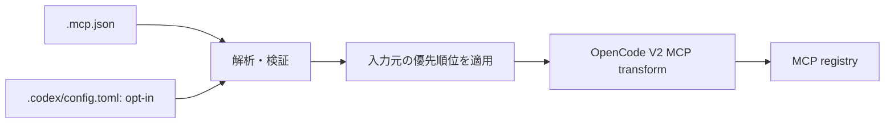

# opencode-mcp-json-adapter

## 目的

OpenCode V2 で、プロジェクトローカルの `.mcp.json` をそのまま利用できるようにする軽量なOpenCode Plugin。

OpenCode固有の `opencode.jsonc` にMCP設定を重複記述する必要をなくし、複数のagent harness間でプロジェクトのMCP設定を共有しやすくする。

## 基本方針

- OpenCode V2のみを対象とする。
- V1互換は提供しない。
- OpenCodeが既にネイティブ対応している機能は再実装しない。
- Claude Code等、特定ハーネス全体との互換性は目的にしない。
- 責務はプロジェクトローカルの MCP 設定の取り込みに限定する。
- 元の `.mcp.json` を正本とし、変換済みファイルは生成しない。
- OpenCodeの設定ファイルを書き換えない。
- 起動時のインメモリ変換だけで完結させる。

## 対象外

以下はOpenCode自身に任せ、このPluginでは扱わない。

- `AGENTS.md`
- `.agents/skills/`
- OpenCode agents
- commands
- hooks
- prompts
- permissions
- provider/model設定
- Claude Code固有設定
- GitHub Copilot固有設定
- Agent Plugin形式
- marketplace / plugin installation infrastructure

将来OpenCode本体が `.mcp.json` をネイティブ対応した場合、このPluginは役目を終えられる程度の薄さを維持する。

## 入力

OpenCode V2 のプラグイン `options.sources` で入力元を選ぶ。省略時は `["mcp-json"]` とし、`"codex"` は明示的に指定した場合だけ読む。例えば `sources: ["mcp-json", "codex"]` は両方を有効にする。配列には `"mcp-json"` と `"codex"` だけを指定でき、重複は除去する。不正な指定では読み込みを行わず診断する。各入力元は OpenCode の現在のプロジェクトルート直下のファイルだけを読む。親ディレクトリやユーザー共通の設定を探索せず、ユーザーグローバルな独自の配置規約も設けない。グローバルプラグインで Codex を opt-in した場合は、その設定が適用される各プロジェクトが読み込み対象になる。プラグイン名と ID の変更は別タスクで検討する。

設定例（パッケージ名は現行のまま記載）:

```jsonc
{
  "plugins": [
    {
      "package": "opencode-mcp-json-adapter",
      "options": { "sources": ["mcp-json", "codex"] }
    }
  ]
}
```

以下の「変換」「スキップ」「無視」は現行実装の挙動を表す。「要検討」は将来の対応を約束するものではない。不正なファイルやサーバーの扱いと、同名定義の優先順位は後述する。

### `.mcp.json`（既定の入力元）

プロジェクトルートの `.mcp.json` にある `mcpServers` オブジェクトを読む。これは MCP プロトコルが定める共通の設定ファイルではなく、本プラグインが採用するクライアント側の設定形式の一部である。取り込むサーバーの基本形式は、原則として Claude Code と Copilot CLI の両方が受け付けるものに限定する。追加のクライアント固有フィールドを無視することと、サーバー形式の選択に使う `type` の独自値を新たに受け付けることは区別する。Agent Plugins v1 が定義するプラグイン内の `mcp.json` とは別ファイル・別形式であり、後者は読み込まない。例:

```json
{
  "mcpServers": {
    "local-tools": {
      "command": "deno",
      "args": ["run", "server.ts"],
      "env": { "MODE": "test" },
      "cwd": "./tools"
    },
    "remote-tools": {
      "type": "http",
      "url": "https://example.com/mcp",
      "headers": { "X-Example": "test" }
    }
  }
}
```

#### 共通の構造・フィールド

| フィールド | 入力形式・対応方針 |
| --- | --- |
| `mcpServers` | 必須のオブジェクト。キーをサーバー名、値を定義オブジェクトとして扱う。欠落・型違いはファイル全体を解析せず診断する。空オブジェクトは可。 |
| `mcpServers.<name>.type` | 省略または `"stdio"` は stdio、`"http"` または `"streamable-http"` は Streamable HTTP。`"sse"`・`"ws"`・`"local"` を含むそれ以外の値は型検証でファイル全体を拒否する。 |
| `mcpServers.<name>.timeout` | stdio・Streamable HTTP 共通。正の安全な整数（ミリ秒）を受け付け、現状は 1000 未満を 1000 に引き上げて OpenCode の `timeout.execution` に渡す。未指定なら OpenCode の既定値またはグローバル設定を使う。0・負数・型違い・整数以外はファイル全体を拒否する。クライアント間の意味の違いは「タイムアウト」で説明する。 |
| 上記・下記以外のフィールド | 現状は検証せず無視する。別のクライアント固有の項目を推測・変換しない。無視した制約・認証の挙動までは再現できない。Copilot CLI 固有の既知項目は後述する。 |

#### stdio（`type` 省略または `"stdio"`）

| フィールド | 入力形式・対応方針 |
| --- | --- |
| `command` | 必須の空白以外を含む文字列。OpenCode の local `command` 配列の先頭へ変換する。 |
| `args` | 任意の文字列配列。環境変数を展開し、`command` の後ろへ追加する。 |
| `env` | 任意の文字列値のマップ。値の環境変数参照を展開し、OpenCode の local `environment` へ渡す。プロセス環境の継承や展開との違いは「環境変数とプレースホルダー」で説明する。 |
| `cwd` | 任意の空白以外を含む文字列。展開せず、OpenCode の local `cwd` へ渡す。 |

`url` が付いている場合は、`command` の有無にかかわらずサーバーをスキップする。HTTP 用の `headers` が付いていても現状は無視する。

#### Streamable HTTP（`type: "http"` または `"streamable-http"`）

| フィールド | 入力形式・対応方針 |
| --- | --- |
| `url` | 必須の絶対 HTTP(S) URL。変数参照があれば専用 opt-in のもとで展開した後に検証し、OpenCode の remote `url` へ渡す。 |
| `headers` | 任意の文字列値のマップ。変数参照があれば専用 opt-in のもとで値を展開し、OpenCode の remote `headers` へ渡す。 |

stdio 用の `command` / `args` / `env` / `cwd` を併記しても現状は無視される。

#### リモートの環境変数展開

Claude Code と Copilot CLI の `.mcp.json` における remote の `url` と `headers` の値の変数展開には、stdio の展開とは独立した**`allowMcpJsonRemoteEnvExpansion: true` による明示的な opt-in**を必須とする。Codex 用の `allowCodexEnvHttpHeaders` は流用しない。remote の `env` は取り込まないため、展開元は OpenCode プロセスの環境変数に限る。例えばプラグイン設定の `"options": {"allowMcpJsonRemoteEnvExpansion": true}` と、`.mcp.json` の `"headers": {"Authorization": "Bearer ${MCP_TOKEN}"}` を組み合わせる。変数はプラグインの読み込み時に解決する。

オプションが無効で `url` または `headers` の値に `${` を含む参照があれば、未展開の値や一部の静的ヘッダーだけで接続せず、**サーバー定義全体をスキップして診断する**。有効時は stdio と同じ `${VAR}` と `${VAR:-default}` を展開し、未定義でフォールバックがない場合や不正な `${...}` 構文も定義全体をスキップする。展開後の URL は絶対 HTTP(S) URL として検証し、ヘッダーの値は HTTP ヘッダーとして検証する。不正なら定義全体をスキップし、診断に展開後の値を含めない。`$VAR` は展開対象外とする。

opt-in は送信先や値の安全性をプラグインが保証する仕組みではなく、**利用者が展開と送信の責任を引き受けるための境界**とする。秘密値かどうかや送信先の妥当性を独自に推測して制限する追加ポリシーは設けない。

#### 旧式 HTTP+SSE（`type: "sse"`）

例えば次の定義を含むファイルは、型検証で全体を拒否する。

```json
{
  "mcpServers": {
    "legacy": { "type": "sse", "url": "https://example.com/sse" }
  }
}
```

SSE 用のフィールドは変換・検証しない。旧式の HTTP+SSE transport は MCP 2026-07-28 仕様で非推奨となったため、意図的に対象外とする。これは Streamable HTTP のレスポンスで使われる SSE を除外するという意味ではない。[^mcp-2026-07-28]

#### WebSocket（`type: "ws"`）

WebSocket は MCP の標準 transport として定義されていないため、`type: "ws"` を含むファイルは型検証で全体を拒否する。WebSocket 用の `wss://` URL やその他のフィールドは変換しない。

#### タイムアウト

`.mcp.json` の同じ `timeout` でも、クライアントによって対象操作が異なる。以下は [Claude Code][claude-mcp] と [Copilot CLI][copilot-cli-mcp] による `.mcp.json` の解釈、[OpenCode V2][opencode-v2-mcp] の受け皿、および現行実装の対照である。

| 形式・クライアント | `timeout` の意味・対象 |
| --- | --- |
| Claude Code の `.mcp.json` | サーバーごとのツール呼び出しの実行時間上限（ミリ秒）。1000 未満は無視し、`MCP_TOOL_TIMEOUT` またはその既定値にフォールバックする。 |
| Copilot CLI の `.mcp.json` | ツールの発見と呼び出しのタイムアウト（ミリ秒、既定 30000）。さらに公式リファレンスは stdio の接続予算にも適用され、接続予算には 60000 ms の下限があると説明する。Claude Code の「1000 未満は無視」という規則は Copilot CLI の公開仕様には記載されていない。 |
| OpenCode V2 | `timeout.startup` は接続・初期化、`timeout.catalog` はツール等の一覧取得、`timeout.execution` はツール呼び出しに加えて MCP prompt の取得と resource の読み取りに適用される。既定は順に 30 秒、30 秒、12 時間。サーバー単位で省略した項目はグローバル設定または既定値が使われる。 |

**現時点の判断:** 正の整数で指定された `.mcp.json` の `timeout` は 1000 ms 以上にして `execution` **だけ**に設定し、`startup` と `catalog` は変更しない。両クライアントに共通する「ツール呼び出しの時間上限」を変換対象にするためである。OpenCode が本来別々に設定する接続・一覧取得まで、一つの値から推測して上書きしない。未設定の `startup` と `catalog` には OpenCode のグローバル設定または既定値が適用される。

Copilot CLI に寄せて `catalog` にも適用するとツール発見の時間上限を再現できる一方、Claude Code の設定でも一覧取得を短い値で打ち切ってしまう。`startup` への単純な適用も Claude Code の意味と異なり、Copilot CLI の接続予算には別の下限がある。そのため、**現行方針は共通部分に当たる `execution` のみへの変換とし、`catalog`・`startup` には適用しない。** 入力元の意味を区別する要件や実際の接続・発見の失敗例など、変更を裏付ける根拠が得られた場合には見直す。

この判断でも完全互換ではない。Copilot CLI では指定値が効くツール発見・接続に同じ値が適用されず、OpenCode の `execution` はツール以外の MCP prompt・resource の取得にも適用される。また、1000 ms への引き上げは本プラグインの方針であり、Copilot CLI の下限を意味しない。

#### 環境変数とプレースホルダー

`env` は stdio サーバー**プロセスに渡す**名前と値のマップであり、設定ファイル内の `$VAR` や `${VAR}` を**展開する機能**とは別である。例えば `"env": {"API_KEY": "${MY_TOKEN}"}` は、展開するクライアントではクライアント側環境の `MY_TOKEN` を読み、子プロセスへ `API_KEY` として渡す。単に `env` に値を追加するだけでは `MY_TOKEN` は展開されない。どの環境変数が子プロセスに自動で継承されるかも別の問題である。

| 形式・クライアント | 展開対象と子プロセス環境 |
| --- | --- |
| Claude Code の `.mcp.json` | `${VAR}` / `${VAR:-default}` を `command`、`args`、`env`、remote の `url`・`headers` で展開する。remote の URL・ヘッダーでは特定の認証用環境変数を空として扱う制限がある。未設定で既定値のない変数は警告し、原則として未展開の文字列を残す。 |
| Copilot CLI の `.mcp.json` | 公式リファレンスが明示する `$VAR` / `${VAR}` / `${VAR:-default}` の展開対象は `env` の値と remote の `headers`。CLI の追加手順は `PATH` の自動継承と、その他の必要な変数の `env` での指定を案内する。一方、[changelog][copilot-cli-changelog] には `command`・`args`・`cwd` で参照した環境変数がサーバー環境へ自動追加される旨の記載がある。単純な「`env` に宣言された変数しか参照できない」という仕様として扱わない。 |
| 本プラグイン | stdio の `args`・`env` の値を展開し、remote の `url`・`headers` の値は専用 opt-in 時だけ展開する。`command`・`cwd` は展開しない。stdio の `env` は `environment` として追加され、OpenCode は元のプロセス環境も継承する。したがって `env` だけで親環境の秘密値を子プロセスから隔離する仕組みではない。OpenCode の `{env:NAME}` という置換構文を `${VAR}` と同一視しない。 |

**変換方針:** stdio サーバーに渡す環境変数の継承は OpenCode の仕様に委ね、`env` の指定がない場合でも継承環境を `PATH` のみに制限しない。展開時の参照元は OpenCode プロセスの環境と `.mcp.json` の同じサーバーの `env` で、同名なら明示した `env` の値を優先する。`args` 等で参照する変数を `env` にも宣言することは必須にしない。`env` の値同士の参照は解決し、循環参照は設定エラーとしてサーバーごとスキップする。Copilot CLI の自動追加の挙動や、Agent Plugins v1 の専用プレースホルダー規則は再現しない。

展開するフィールドは stdio の `args`・`env` の値だけ。`command` は起動する実行ファイル名、`cwd` は作業ディレクトリとしてそのまま渡す。Claude Code と Copilot CLI の公開資料は `cwd` の展開を共通の動作として保証していないため対象に加えない。変数名は英字・数字・アンダースコア（先頭は英字またはアンダースコア）とし、`${VAR}` と `${VAR:-default}` のみを展開する。Copilot CLI 独自の `$VAR` は展開しない。未定義の `${VAR}`、未対応の `${...}` 構文、循環参照はサーバー定義全体をスキップする。未定義または空文字列の場合は `:-default` を使い、明示的に空文字列にしたい場合は `${VAR:-}` を使える。診断に展開後の値を含めない。

環境変数の値が秘密かどうかは機械的に判別できないため、「秘密値だけを `args` へ展開しない」という制御は設けられない。`args` への展開は値の露出先を変えるが、クライアント間の互換性を保ったまま一律に安全を保証することはできない。remote の `url`・`headers` の展開には、前述の別 opt-in 方針を適用する。

#### Copilot CLI 固有項目（変換対象外）

[Copilot CLI の MCP 設定リファレンス][copilot-cli-mcp]にある次の項目は、共通して変換可能な `.mcp.json` の基本項目とは分けて扱う。Claude Code で Copilot CLI 固有フィールドを持つサーバーが無効になったという利用者の検証結果があるが、本プラグインでフィールドごとの差を再現検証したものではない。**本プラグインは Claude Code の検証・拒否動作を互換性の基準としない。** Copilot CLI 独自項目があるだけでサーバー全体を無効化せず、変換できるフィールドだけを OpenCode に渡す。

| フィールド・指定 | Copilot CLI の意味 | 現行実装と今後の扱い |
| --- | --- | --- |
| stdio の `type: "local"` | `"stdio"` の別名。 | Claude Code と Copilot CLI の共通の `type` ではないため、意図的に受け付けず、サーバーごとスキップする。stdio を指定するなら `"stdio"` を使用する。 |
| `tools` | サーバーから使えるツールの絞り込み。 | 現状は無視してサーバーを登録する。OpenCode のサーバー定義にそのまま渡せるフィールドではなく、Copilot CLI 側のツール制限は再現されない。 |
| `deferTools` / `disableToolCache` / `slowConnectionThresholdMs` | ツールの表示・キャッシュ・接続遅延の警告を制御する。 | 現状は無視してサーバーを登録する。 |
| remote の `oauthClientId` / `oauthScopes` / `oauthPublicClient` / `oauthGrantType` | Copilot CLI 固有の OAuth クライアント設定。 | 現状は無視して remote サーバーを登録する。Copilot CLI の OAuth 設定は再現せず、必要な認証は OpenCode 側の動作に委ねる。 |
| `oidc` | stdio の環境変数または remote の Bearer ヘッダーへ OIDC トークンを渡す指定。 | 現状は無視してサーバーを登録する。Copilot CLI のトークン注入は再現しない。 |

独自項目は認識したうえで変換・検証せず、**存在だけを理由にサーバー定義全体をスキップしない**。これは「Claude Code と同じ動作」や「Copilot CLI の全項目との互換性」を意味しない。`tools` の制限や認証方式は取り込まれず、OpenCode 側では利用可能なツールや認証の挙動が変わり得る。制限を維持する必要があれば OpenCode ネイティブの権限設定等を別途使用する。この方針は、ファイル全体を拒否する不正な基本項目や非対応の `type` には適用しない。

#### 参考仕様：Agent Plugins v1 の `mcp.json`（入力対象外）

[Agent Plugins 1.0.0][agent-plugins-v1] は、インストールされた Agent Plugin のルートに置く `mcp.json` を定義する。**プロジェクトルートの `.mcp.json` を定義する仕様ではない。** 本プラグインは `plugin.json` やプラグイン内の `mcp.json` を探索・検証せず、Agent Plugins v1 準拠を目指すものでもない。以下は将来の設計の参考としての対照であり、上記 `.mcp.json` の入力仕様には含めない。

- 閉じたサーバー定義に `timeout` は存在しない。`.mcp.json` のタイムアウトに追加の意味を与える根拠にはならない。
- stdio では、クライアントが提供する `${PLUGIN_ROOT}` と `${PLUGIN_DATA}` だけを `args`・`env` の値・`cwd` で一度だけ置換し、再帰的には展開しない。`command`、`env` のキー、remote の `url`・`headers` は展開せず、その他の変数参照はそのまま残す。子プロセスの基礎環境はクライアントが選べるが、両予約変数の提供は必須。
- 展開規則を Claude Code や Copilot CLI の `.mcp.json` にそのまま適用することはできない。例えば Agent Plugins v1 は展開する変数名を2種類に限定する一方、`args`・`cwd` の展開を規定しており、Copilot CLI の公開リファレンスはそれらの展開を保証していない。適用範囲や環境変数の継承に単純な包含関係はない。

### `.codex/config.toml`（明示 opt-in の入力元）

プロジェクトルートの `.codex/config.toml` のトップレベルの `[mcp_servers]` だけを読む。Codex の trust 判定、設定の他レイヤー、profiles・model・sandbox・approval などの MCP 以外の項目は取り込まない。例:

```toml
[mcp_servers.local-tools]
command = "deno"
args = ["run", "server.ts"]
env = { MODE = "test" }
cwd = "./tools"

[mcp_servers.remote-tools]
url = "https://example.com/mcp"
http_headers = { "X-Example" = "test" }
env_http_headers = { "X-Region" = "MCP_REGION" }
bearer_token_env_var = "MCP_TOKEN"
```

後者の `env_http_headers` と `bearer_token_env_var` を含むサーバーを取り込むには、前述の `sources` に加えてプラグイン設定で `"allowCodexEnvHttpHeaders": true` が必要。真偽値の `true` 以外では有効にならない。以下は [Codex の MCP 設定項目][codex-mcp] と現行パーサーの対応関係であり、OpenCode ネイティブの設定項目一覧ではない。

#### 共通の構造・フィールド

Codex のサーバー定義には `type` フィールドがない。`url` があれば Streamable HTTP、それ以外は stdio として扱う。ただし `url` と `command` を同時に指定するとサーバーをスキップする。

| フィールド | 入力形式・現行の対応方針 |
| --- | --- |
| `mcp_servers.<name>` | トップレベルのテーブル。キーをサーバー名として扱う。`mcp_servers` がなければ何も追加しない。テーブル以外は診断する。 |
| `enabled` | 真偽値。`false` なら取り込まない。省略・`true` なら以下を検証する。型違いはファイル全体を拒否する。 |
| `startup_timeout_sec` / `startup_timeout_ms` / `tool_timeout_sec` | Codex の秒単位の起動・ツール実行タイムアウトと、起動タイムアウトのミリ秒単位の別名。現状は無視する。OpenCode のタイムアウトとの意味・単位の対応を調べてから変換可否を判断する。 |
| `required` | 接続失敗時の起動失敗指定。現状は無視する。OpenCode に同等の動作を保証できるか要検討。 |
| `enabled_tools` / `disabled_tools` | ツールの許可・拒否リスト。現状は**無視してサーバーを登録する**。Codex で制限していたツールが OpenCode では見える可能性があり、優先して安全な扱いを決める必要がある。 |
| `default_tools_approval_mode` / `[mcp_servers.<name>.tools.<tool>]` | ツールごとの `approval_mode` や `output_token_limit` を含む Codex の承認・出力制約。現状は**無視してサーバーを登録する**。権限境界の違いを踏まえ、警告・サーバー単位のスキップ・対応の可否を要検討。 |
| 上記・下記以外のサーバー項目 | 現状は無視する。未知の認証・実行・権限制約まで安全に無視できるという保証ではない。 |

#### stdio（`url` なし）

| フィールド | 入力形式・現行の対応方針 |
| --- | --- |
| `command` | 必須の非空文字列。OpenCode の local `command` 配列の先頭へ変換する。未指定・不正ならファイル全体を拒否する。 |
| `args` | 任意の文字列配列。`command` の後ろへ追加する。 |
| `env` | 任意の文字列値のマップ。OpenCode の local `environment` へ変換する。 |
| `cwd` | 任意の非空文字列。OpenCode の local `cwd` へ渡す。 |
| `env_vars` | Codex の環境変数転送指定。現状はサーバーごとスキップして診断する。`env` とは別の機能であり、ローカル・リモートの値の取得元も含めて要検討。 |
| `experimental_environment` | `remote` を指定してリモート実行環境で stdio を起動する Codex 固有の項目。現状は無視し、OpenCode のローカル stdio として登録するため、誤実行を避ける扱いが要検討。 |

HTTP 用の `http_headers` を付けても現状は無視される。`env_http_headers`、`bearer_token_env_var`、`http_headers_helper`、`auth`、`oauth`、`bearer_token` を付けた場合はサーバーをスキップする。

#### Streamable HTTP（`url` あり）

| フィールド | 入力形式・現行の対応方針 |
| --- | --- |
| `url` | 必須の絶対 HTTP(S) URL。OpenCode の remote `url` へ渡す。`command` との併用はスキップする。 |
| `http_headers` | 任意の文字列値のマップ。OpenCode の remote `headers` へ変換する。 |
| `env_http_headers` | ヘッダー名と環境変数名の文字列マップ。既定ではサーバー定義ごとスキップ。`allowCodexEnvHttpHeaders: true` 時のみ環境変数を読み、未設定・空白ならそのヘッダーを省略し、値があれば同名の静的ヘッダーより優先する。 |
| `bearer_token_env_var` | Bearer トークンの環境変数名を表す非空文字列。既定ではサーバー定義ごとスキップ。同じ opt-in 時に `Authorization: Bearer <値>` を組み立て、同名の静的・環境変数由来ヘッダーより優先する。未設定・空白・不正な値ならサーバーごとスキップし、認証なしで登録しない。OAuth のログイン・更新は実装しない。 |
| `http_headers_helper` | 動的ヘッダー取得コマンド。現状はサーバーごとスキップして診断する。再取得・再試行やコマンド実行を伴うため、静的ヘッダーへの変換はしない。 |
| `auth` / `[mcp_servers.<name>.oauth]` | Codex の認証選択（`oauth` / `chatgpt`）や OAuth クライアント設定（`client_id`、`callback_url`、`callback_port`）。現状はサーバーごとスキップして診断する。OpenCode ネイティブの OAuth と同一視して自動変換しない。OAuth が必要でもこれらの項目がなければ、取り込んだ remote サーバーへの認証は OpenCode に任せる。 |
| `scopes` / `oauth_resource` | Codex が OAuth で要求するスコープの配列と対象リソースの指定。現状は無視する。認証の対象・権限が変わる可能性があるため、黙殺の安全性を要検討。 |
| `bearer_token` | パーサーが認証の黙殺を避けるため拒否する項目。現状はサーバーごとスキップして診断する。Codex の一般的な設定項目としてのサポートを意味しない。 |

stdio 用の `args` / `env` / `cwd`、Codex の `experimental_environment` を併記しても現状は無視される。`env_vars` は transport にかかわらず定義全体をスキップする。

トップレベルの `mcp_optional_startup_grace_ms`、`mcp_oauth_callback_port`、`mcp_oauth_callback_url` など、`mcp_servers` 以外の Codex 設定はすべて無視する。これらは現状のパーサーによる取り込み範囲外であり、Codex 全体の設定互換は目指さない。

Bearer と任意の環境変数由来ヘッダーは同じ opt-in にまとめるが、Codex の秘密値隔離ポリシーは再現しない。プラグインが OpenCode プロセスの環境変数を起動時に読み、登録時に秘密値を渡す。リスクとグローバル設定での適用範囲は README に記載する。

[codex-mcp]: https://developers.openai.com/codex/mcp
[claude-mcp]: https://code.claude.com/docs/en/mcp
[copilot-cli-mcp]: https://docs.github.com/en/copilot/reference/copilot-cli-reference/cli-command-reference#mcp-server-configuration
[copilot-cli-changelog]: https://redirect.github.com/github/copilot-cli/blob/main/changelog.md
[agent-plugins-v1]: https://agent-plugins.org/specification#7-2-mcp-servers
[opencode-v2-mcp]: https://opencode.ai/v2/docs/mcp-servers#timeouts

[^mcp-2026-07-28]: [MCP 2026-07-28 仕様の発表（Deprecations）](https://redirect.github.com/modelcontextprotocol/modelcontextprotocol/blob/main/blog/content/posts/2026-07-28-spec-ga/index.md)

## 変換

概念的には以下とする。



独立した内部表現は設けず、解析済みの定義を共通の MCP transform に渡す。

## OpenCode統合

OpenCode V2 Plugin APIのMCP extension pointを使用する。

Plugin ID:

```text
opencode-mcp-json-adapter
```

## 設定優先順位

OpenCodeネイティブ設定を優先する。

同じserver nameが `.mcp.json` と `opencode.jsonc` の両方に存在する場合は、`opencode.jsonc` 側を採用する。

`.mcp.json` はfallback/import sourceとして扱う。

Codex を有効化した場合も OpenCode ネイティブ設定を最優先する。import 元同士で同名サーバーがある場合は `sources` の先に書いた入力元の有効な定義を採用し、通常は衝突警告を出さない。設定上の優先順位をエージェント向けの警告に依存させない。

## エラー処理

`.mcp.json` が存在しない場合は何もしない。

JSONが不正な場合は対象ファイルと理由が分かる診断を出す。

未知のフィールドは可能な限り無視する。

既知の構造・フィールドに型違反があれば、入力ファイル全体を取り込まない。型検証後の opt-in 不足・変数展開失敗・未対応の認証などはサーバー単位でスキップし、他の正常なサーバーを維持する。

secretになり得る値をログへ出力しない。

## `.mcp.json` dialect

MCP protocolそのものと `.mcp.json` のclient-side設定形式は別物であることをREADMEで明記する。

初期実装では、広く使われているproject-local `.mcp.json` の共通部分のみを対象とする。

特定ハーネス固有拡張を大量に取り込まない。

## 配布

OpenCode V2 Pluginとしてnpm packageで配布する。

利用者はOpenCodeのPlugin機構から追加できる形を想定する。

グローバルPluginとして導入し、各repositoryの `.mcp.json` を自動利用できるUXを推奨する。

## 開発時の利用

開発中は公開packageを使用せず、OpenCodeのプロジェクトローカル設定からローカルrepositoryを直接参照できるようにする。

公開版と開発版で同じPlugin IDを使用する。

必要なら開発環境ではグローバル版を無効化してローカル版を優先する。

## テスト

最低限以下を自動テストする。

- `.mcp.json` がない
- 空のserver一覧
- stdio server
- stdio + args
- stdio + env
- remote server
- remote + headers
- 複数server
- malformed JSON
- 一部serverのみ型違反の場合のファイル全体の拒否
- 未知field
- OpenCodeネイティブ設定との名前衝突
- Windows向けcommand/path
- Unix向けcommand/path

変換処理はOpenCode本体を起動せずunit testできるよう分離する。

Codex 対応では、既定の入力元、Codex の opt-in、MCP 以外の設定の無視、stdio / remote の変換、入力元同士と OpenCode ネイティブ設定との同名衝突、不正な TOML や一部のみ型違反のサーバー定義をテストする。静的な `http_headers` と opt-in の `env_http_headers` / `bearer_token_env_var` は OpenCode 経由の受信確認も行う。環境変数由来のヘッダーは無効時のサーバー単位のスキップ、有効時の未設定・空白・静的ヘッダーとの衝突をテストする。

## セキュリティ

Plugin自身はcommandを実行しない。

`.mcp.json` を読み、OpenCodeへserver definitionとして渡すだけにする。

環境変数やheader値などsecretになり得る値をログへ出さない。

ファイル探索はworkspace外へ不用意に広げない。

## 成功条件

ユーザーがグローバルに `opencode-mcp-json-adapter` を有効化していれば、

```text
repo/
├─ .mcp.json
└─ ...
```

だけで、そのMCP server群をOpenCode V2から利用できる。

かつ、

- repositoryに生成ファイルを追加しない
- `.mcp.json` を変更しない
- OpenCodeネイティブMCP設定を壊さない
- `AGENTS.md` / Skills等には介入しない
